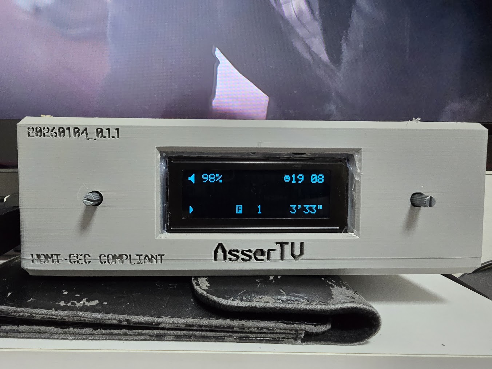

# AsserTV: A Reinterpretation of Old School DVD Player Into This World



Full Featured Front Panel Interfacing Software for Raspberry Pi KODI Media Hub.

## Backstory of this project

Do you remember those silver colored bulky DVD players that you had in 90s / early 00s?  
Ever since I was a kid, I was literally obsessed with these. It looked cool.  
Very informative even without hooking TV up. Had a **HUGE** display on it.  
Some of them are VFD which added even more coolness.

And now, we can't find these “machines” anymore.  
Everything is integrated in a small device. Things are getting minimal over time. Needless to say, no displays anymore.  
Well.. a display that I am desperately looking for is not the only thing that disappeared like a wind.  
The whole unit is getting integrated in a TV or a dedicated adapter these days,  
so I can safely say that at this point the hardware itself is completely wiped out from our eyesight.

And I found my old Rpi 3B+ staying calm inside my closet – I still can't figure out why it went there,  
but somehow it was there, and resurrecting her was quite easy.

I am an embedded engineer. I make not just codes, but working electronic products.  
Lots of character LCDs are in my parts stock, and I especially loved one with 20x04 characters and **RGB Backlight**.  
Rpi has GPIOs, and this is one of the reasons people choose Rpi over other boards.  
At this point, I am determined. Hell yeah.

The main goal of this project is **to reinterpret the old school hardware design**. 

---

## What this project is

This repo contains a small C program that turns a Raspberry Pi running KODI into an old-school media box front panel with:

- a 20x4 HD44780-compatible character LCD  
- two rotary encoders with push buttons  
- three playback buttons  
- an RGB backlight and a tiny buzzer  

The program talks to KODI over JSON-RPC and mirrors part of the player state on the LCD,  
while letting you control volume and (later) playback using the front panel.

This is a hobby project. I am mainly an embedded systems guy, not a Linux user-space guru,  
so expect a “works for me, hackable” style rather than a production-grade daemon.

---

## The origin of project name

There is a popular Gen-Z meme in Korea called '어쩔티비'. For people around the world and unaware of korean meme and terms, '어쩔' means 'So what?' and '티비' is pretty much literally means a television. 

This meme word is quite old for 2026, but still popular and widely used. One student on the internet claimed that the English word 'Assertive' is pronounced similar to this meme word and I found it pretty fun!

Moreover, **Assertiveness** is the concept I love. This device itself, and a developer which is me are pretty much **Assertive**, so I found that naming my project "AsserTV" is an interesting idea.

So yeah. its not just a meme word, its the main value that I, and all of my personal projects persue. and Here an **AsserTV** is. 


---

## Current features

- **20x4 LCD driver**
  - Direct 4-bit GPIO driver for an HD44780-style character LCD
  - Helper that always writes full 20-character lines so no garbage is left on the screen
  - Cursor positioning and custom character (CGRAM) support

- **Dual rotary encoders**
  - **Volume encoder**
    - Rotation changes KODI volume in the 0-100 range
    - LCD shows a pseudo dB line like: `MUSIC Vol:-20dB` (100 becomes 0 dB)
    - Short press toggles mute on KODI
    - Long press currently just writes a debug message on the LCD
  - **Menu encoder**
    - Rotation changes a simple `menu_index` value (0-99)
    - Short / long press prints placeholder text on the LCD
    - Intended as the base for a future menu / navigation UI

- **Playback buttons (REW / PLAY / FF)**
  - Three discrete GPIO buttons
  - Debounced in software and classified as **short click / long press**
  - Input side is implemented, but not yet connected to KODI player control in `main_kodi.c`

- **KODI JSON-RPC wrapper**
  - Simple HTTP JSON-RPC helper built on top of `libcurl`
  - Provides:
    - get/set volume and mute
    - query “now playing” metadata (`kodi_now_playing_t`)
    - basic player control (play/pause, stop, next/previous, small seek)
    - basic GUI info + input functions
  - `main_kodi.c` currently uses only the volume/mute path; the rest is ready for future use

- **Front panel hardware abstraction**
  - `panel_hw` module for RGB backlight and buzzer
  - Simple API:
    - `panel_set_rgb(r, g, b)`
    - `panel_beep_ms(...)`, `panel_beep_short()`
  - Uses pigpio PWM on GPIO14/15/18 for RGB and GPIO23 for the buzzer

---

## Hardware

Tested on:

- Raspberry Pi 3B+ (any 40-pin Raspberry Pi should work)
- 20x4 HD44780-compatible character LCD with RGB backlight
- 2 × rotary encoders with push button (volume + menu)
- 3 × momentary push buttons (REW / PLAY / FF)
- Small piezo buzzer

### Wiring (BCM numbering)

All switches use internal pull-ups and are active-low to GND.

**LCD (4-bit parallel, HD44780)**

| Signal | BCM | Physical pin |
|--------|-----|--------------|
| RS     | 26  | 37           |
| E      | 19  | 35           |
| D4     | 13  | 33           |
| D5     | 6   | 31           |
| D6     | 5   | 29           |
| D7     | 11  | 23           |

(Other LCD pins like VCC, GND, contrast pot, backlight power are wired in the usual way.)

**RGB backlight & buzzer**

| Function | BCM | Physical pin |
|----------|-----|--------------|
| R        | 14  | 8            |
| G        | 15  | 10           |
| B        | 18  | 12           |
| Buzzer   | 23  | 16           |

**Rotary encoders**

Volume encoder:

| Signal | BCM | Physical pin |
|--------|-----|--------------|
| A      | 17  | 11           |
| B      | 27  | 13           |
| BTN    | 22  | 15           |

Menu encoder:

| Signal | BCM | Physical pin |
|--------|-----|--------------|
| A      | 16  | 36           |
| B      | 20  | 38           |
| BTN    | 21  | 40           |

**Playback buttons**

| Button       | BCM | Physical pin |
|--------------|-----|--------------|
| REW          | 2   | 3            |
| PLAY / PAUSE | 3   | 5            |
| FF           | 4   | 7            |

---

## Software layout

- `lcd.[ch]`  
  20x4 HD44780-compatible LCD driver (4-bit mode, line helpers, custom chars)

- `encoder.[ch]`  
  Generic quadrature decoder for up to 2 encoders, with click / long-press handling

- `buttons.[ch]`  
  Simple helper for the three playback buttons

- `panel_hw.[ch]`  
  RGB backlight and buzzer abstraction

- `kodi_rpc.[ch]`  
  Plain C JSON-RPC client built on `libcurl`

- `main_kodi.c`  
  Glue code that ties everything together into the actual front panel app

---

## Dependencies

- Raspberry Pi OS (or similar) running on a Raspberry Pi
- `pigpio` library
- `libcurl`
- A KODI instance running on the same Pi with HTTP / JSON-RPC enabled  
  - Settings → Services → Control → “Allow remote control via HTTP”  
  - Default host/port is `127.0.0.1:8080`

On Raspberry Pi OS, something like:

```bash
sudo apt update
sudo apt install build-essential pigpio libcurl4-openssl-dev
```

should be enough.

## Run

pigpio uses /dev/mem, so the easiest way is to run this as root:

sudo ./mediabox_lcd_ctrl

Make sure:

> KODI is already running on the same Pi

> HTTP / JSON-RPC is enabled and listening on 127.0.0.1:8080

> Your wiring matches the tables above

When it is running, the LCD will show something like:

> Line 0: current volume + mute state, Current Time

> Line 2 / 3: current menu index when unit is being operated. if not, displays current media info. 

> Line 4: Media progression status (F001  000'00")

Rotate the volume encoder and check that KODI volume changes.
Push the volume encoder to toggle mute.


## Roadmap / ideas

This project is still evolving thanks to my dream and motivation.

Next version will include

> MCU Driven display and buttons
> Full-featured 192x64 GLCD
> more sophisticated 3D print STL
